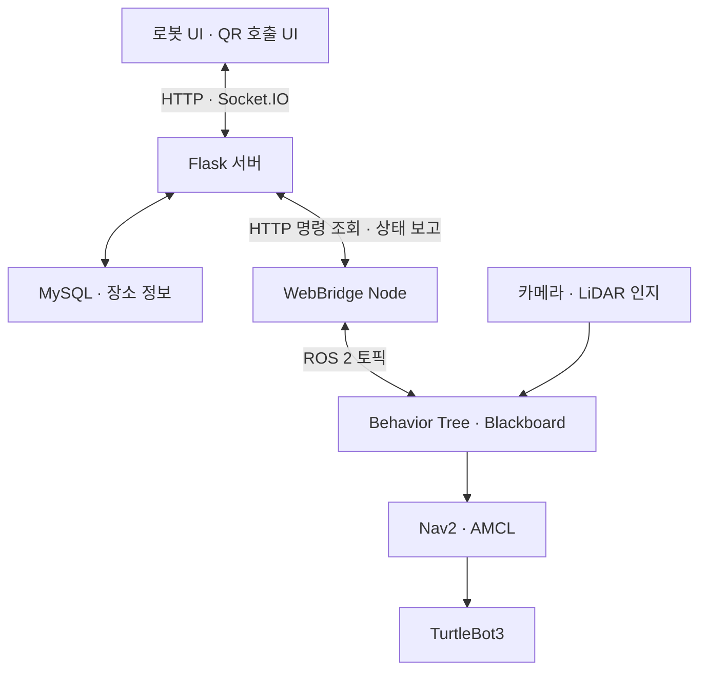

# Aero · 자율주행 공항 안내 로봇

> 목적지 선택부터 도착 안내까지, 웹과 ROS 2를 연결한 실내 길 안내 서비스

<p align="center">
  
</p>

**[실제 로봇 시연 영상](https://youtu.be/HOmyxXTMj24)** · [핵심 코드](#핵심-코드) · [실행 방법](#실행-방법)

## 프로젝트 소개

Aero는 GPS 사용이 어려운 대형 실내 시설을 가정해 만든 공항 안내 로봇입니다. 사용자가 로봇 화면에서 목적지를 선택하면 Nav2로 이동하며 안내합니다. 주변에 로봇이 없을 때에는 장소별 QR 코드로 호출할 수 있습니다.

**로밍 → 사용자 확인 → 목적지 선택 → 길 안내 → 도착 → 다시 로밍**으로 이어지는 서비스 흐름을 구현했습니다. 실제 공항에 배치한 제품이 아닌 TurtleBot3 기반 실내 프로토타입입니다.

| 항목 | 내용 |
| --- | --- |
| 개발 기간 | 2026.06–2026.07 |
| 프로젝트 형태 | 팀 프로젝트 |
| 하드웨어 | TurtleBot3 Waffle Pi, Raspberry Pi, 2D LiDAR, 전·후방 카메라 |
| 로봇 소프트웨어 | Ubuntu 22.04, ROS 2 Humble, Python, Nav2, AMCL, YOLOv8, OpenCV |
| 서비스 소프트웨어 | Flask, Flask-SocketIO, MySQL, HTML/CSS/JavaScript |

## 주요 기능

| 기능 | 구현 내용 |
| --- | --- |
| 목적지 안내 | 장소 목록에서 하나 이상의 목적지를 선택하고 순서대로 안내 |
| QR 호출 | QR에 연결된 장소 정보를 기준으로 호출 요청 생성 |
| 주행 상태 표시 | 안내 상태와 경로를 웹 화면에 표시하고 일시정지·재개·중지 요청 처리 |
| 행동 제어 | Python으로 작성한 Selector·Sequence와 Blackboard로 상태와 우선순위 관리 |
| 사용자 인지 | 전·후방 카메라의 사람 검출, 후방 HSV 특징 추적과 LiDAR 정보를 안내 제어에 활용 |

## 시스템 구조



웹 서버와 로봇 사이에는 HTTP API를 사용합니다. WebBridge가 새 명령을 주기적으로 조회해 ROS 2 토픽으로 전달하고 로봇 상태와 경로를 서버에 보고합니다. **Socket.IO는 Flask 서버와 브라우저 사이의 화면 갱신에 사용합니다.**

## 주요 구현과 문제 해결

### 명령의 중복 처리 방지

주기적인 조회에서는 같은 명령이 다시 수신될 수 있습니다. 명령 ID와 처리 여부를 사용하고 WebBridge에서 마지막으로 처리한 ID를 확인해 새로운 명령만 전달하도록 구성했습니다.

### 명령 전달과 상태 표시 분리

사용자가 버튼을 누른 시점과 로봇이 실제로 행동을 수행하는 시점은 다릅니다. 명령 전달 이후 로봇의 상태를 다시 서버로 보고하고 Socket.IO로 화면을 갱신하도록 구성했습니다.

### 장소 이름을 주행 좌표로 연결

사용자는 장소 이름을 선택하지만 Nav2에는 위치와 방향이 필요합니다. MySQL 장소 정보와 선택 순서로 경로 데이터를 구성하고 WebBridge를 거쳐 행동 제어 노드에 전달합니다. 경로 전처리 노드는 Nav2의 `ComputePathToPose` 결과를 웹 표시용 데이터로 변환합니다.

## 핵심 코드

| 관심 영역 | 코드 |
| --- | --- |
| 웹 API·명령·상태 처리 | [Flask 서버](web/flask_server/app.py) |
| 로봇 UI·QR UI | [화면 템플릿](web/flask_server/templates) · [JavaScript](web/flask_server/static/js) |
| 장소 정보 조회 | [데이터베이스 모듈](web/flask_server/database) |
| 웹–ROS 2 통신 | [WebBridge](src/web_bridge/web_bridge/web_data.py) |
| 행동 우선순위·상태 관리 | [Behavior Tree](src/behavior_tree/behavior_tree/bt_main.py) · [제어 노드](src/behavior_tree/behavior_tree/bt_nodes.py) |
| 경로 전처리 | [Path Node](src/behavior_tree/behavior_tree/path_node.py) |
| 사용자 인지 | [Perception](src/perception/perception) |
| 통합 실행 | [Robot Launch](src/robot_bringup/launch/robot.launch.py) |

## 실행 방법

이 저장소는 실습 당시 로봇·네트워크·지도 환경을 기준으로 작성되었습니다. ROS 2 Humble, TurtleBot3 브링업, 카메라, Nav2·AMCL과 MySQL을 별도로 준비해야 합니다.

### 1. 복제 및 빌드

```bash
git clone https://github.com/ros2-team/Project_Aero.git
cd Project_Aero
source /opt/ros/humble/setup.bash
rosdep install --from-paths src --ignore-src -r -y
colcon build --symlink-install
source install/setup.bash
```

Flask, Flask-SocketIO, PyMySQL, requests, ultralytics, OpenCV 등 Python 의존성도 필요합니다. 저장소 안의 TurtleBot3 관련 gitlink만으로 외부 패키지 설치가 완료되지는 않으므로 ROS 2 Humble에 맞는 TurtleBot3 패키지를 별도로 구성해야 합니다.

### 2. 환경 설정

| 확인할 항목 | 위치 |
| --- | --- |
| Flask 서버 주소 | `src/web_bridge/web_bridge/web_data.py`의 `flask_base_url` |
| DB 접속 정보와 장소 데이터 | `web/flask_server/database/` |
| 지도·초기 위치·Nav2 설정 | 로봇의 Nav2·AMCL 실행 환경 및 `src/robot_bringup/maps/` |
| 카메라 토픽·보정값·장치 경로 | `src/perception/` 및 전방 카메라 노드 |
| YOLO 모델 | `yolov8n.pt`를 로드할 수 있는 환경 |

현재 저장소에는 초기 DB 스키마·장소 데이터 전체와 외부 로봇 설정이 포함되어 있지 않습니다. 위 구성을 준비한 후 실행합니다.

### 3. 웹과 ROS 2 애플리케이션 실행

```bash
# 터미널 1: 프로젝트 루트에서 웹 서버 실행
python3 web/flask_server/app.py
```

```bash
# 터미널 2: 로봇 브링업·Nav2·AMCL·카메라를 준비한 뒤 실행
source /opt/ros/humble/setup.bash
source install/setup.bash
ros2 launch robot_bringup robot.launch.py
```

브라우저에서 `http://<Flask 서버 IP>:5000`으로 접속합니다. `robot.launch.py`는 Perception·Behavior Tree·WebBridge를 실행하며 하드웨어 드라이버와 Nav2를 함께 시작하는 런처는 아닙니다.

## 결과와 구현 범위

목적지 선택·QR 호출·웹 명령 전달·로봇 행동·화면 상태 표시가 이어지는 안내 흐름을 구현하고 시연했습니다. 로봇 기능을 사용자 서비스로 연결하려면 명령뿐 아니라 처리 결과와 상태를 되돌려주는 구조가 중요하다는 점을 경험했습니다.

- 실내 실습 환경 기준으로 개발했으며 실제 공항의 혼잡 환경에서 검증한 시스템은 아닙니다.
- ArUco 기반 도킹 코드는 [별도 노드](src/perception/perception/docking_node.py)로 남아 있으나 기본 통합 런치에는 포함되어 있지 않습니다. 자동 충전의 전체 연계나 도킹 성공률을 보장하지 않습니다.
- 저장소에서 확인할 수 없는 정확도·성공률 수치는 기재하지 않았습니다.
